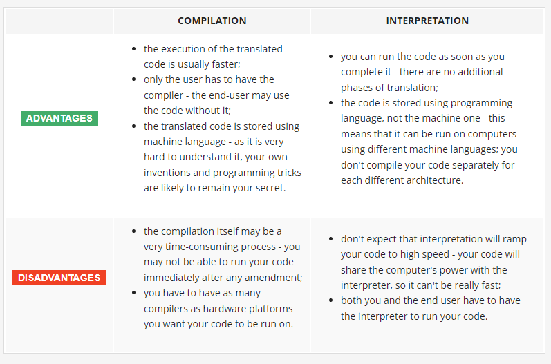
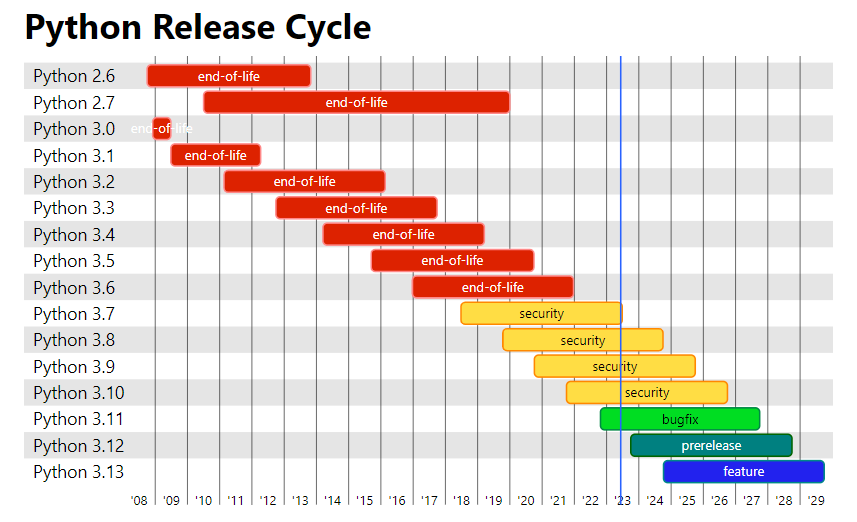

# Uvod v Python ekosistem

## Kako deluje program na računalniku?
A **program makes a computer usable.** Without a program, a computer, even the most powerful one, is nothing more than an object.

It can **execute only extremely simple operations.** For example, a computer cannot understand the value of a complicated mathematical function by itself, although this isn't beyond the realms of possibility in the near future.

### High-level and low-level languages

A **high-level language is one that is user-oriented** in that it has been designed to make it straightforward for a programmer to convert an algorithm into program code. A **low-level language is machine-oriented**. Low-level programs are expressed in terms of the machine operations that must be performed to carry out a task.

| **Differentiating factor** | **Low-level programming language**                                                                                            | **High-level programming language**                                                                                      |
|----------------------------|-------------------------------------------------------------------------------------------------------------------------------|--------------------------------------------------------------------------------------------------------------------------|
| Definition                 | Language with less abstraction such that it is directly understandable and executable on the machine it is being written for. | Language with higher abstraction such that it is easy to interpret and understand for humans and is machine-independent. |
| Portability                | Not portable from one device to another.                                                                                      | Portable from one device to another.                                                                                     |
| Friendliness               | Machine-friendly language                                                                                                     | Programmer-friendly language                                                                                             |
| Understandability          | Difficult to understand, maintain and debug                                                                                   | Easy to understand, maintain and debug                                                                                   |
| Speed                      | High                                                                                                                          | Low                                                                                                                      |
| Memory efficient           | Comparatively high memory efficiency.                                                                                         | Comparatively low memory efficiency.                                                                                     |
| Translation process        | Usage of assembler whilst converting assembly language to machine language for consumption by CPU.                            | Usage of compiler/interpreter for translating into the machine-understandable format.                                    |
| Pre-requisite Knowledge    | Knowledge of computer architecture is necessary.                                                                              | Knowledge of computer hardware is not necessary.                                                                         |
| Instruction set            | Low-level instructions like a series of binary codes of 0s and 1s OR mnemonics like ADD, SUB, DIV, MUL, etc.                  | An interpreted or compiled programming language which has its own set of syntax and semantics.                           |
| Examples                   | Examples are: Assembly language and Machine language                                                                          | Examples are: Java, Python, COBOL                                                                                        |

[Source](https://unstop.com/blog/difference-between-high-level-and-low-level-languages)

<!-- Source: https://d8it4huxumps7.cloudfront.net/bites/wp-content/banners/2022/11/637afe7e1cacd_difference_between_high-level_and_low-level_languages.png?d=1200x800 -->

## Uvod v programske jezike
A program written in a high-level programming language is called a **source code** (in contrast to the machine code executed by computers). Similarly, the file containing the source code is called the **source file**.

### Compilation vs. interpretation
There are two different ways of transforming a program **from a high-level programming language into machine language**:
- **COMPILATION**: The source program is translated once (however, this act must be repeated each time you modify the source code) by getting a file (e.g., an .exe file if the code is intended to be run under MS Windows) containing the machine code; now you can distribute the file worldwide; the program that performs this translation is called a compiler or translator.
- **INTERPRETATION**: You (or any user of the code) can translate the source program each time it has to be run; the program performing this kind of transformation is called an interpreter, as it *interprets the code every time it is intended to be executed*; it also means that you cannot just distribute the source code as-is, because the end-user also needs the interpreter to execute it.

[Source](https://edube.org/learn/python-essentials-1/programming-absolute-basics-compilation-vs-interpretation-5)

About Python:
- Python is an **interpreted language**. This means that it inherits all the described advantages and disadvantages.
- If you want to program in Python, you'll need the **Python interpreter**. You won't be able to run your code without it. Fortunately, Python is **free**. This is one of its most important advantages.

### What does the interpreter actually do?
A computer program is actually a piece of text, so the source code is usually placed in **text files**.

The interpreter **reads the source code from top to bottom** and from left to right.
1. First of all, the interpreter checks if all subsequent lines are correct.
2. If the interpreter **finds an error**, it finishes its work immediately. The only result in this case is an error message.
3. The interpreter will inform you where the error is located and what caused it. However, these messages may be misleading, as the interpreter isn't able to follow your exact intentions, and may detect errors at some distance from their real causes.
4. If the line looks good, the interpreter tries to execute it.
5. It is also possible that a significant part of the code may be executed successfully before the interpreter finds an error. This is normal behavior in this execution model.

## Pregled osnovnih pojmov
- Due to historical reasons, languages designed to be utilized in the interpretation manner are often called **scripting languages**, while the source programs encoded using them are called **scripts**.
- **Virtual machine - virtualka**: A Virtual Machine (VM) is a compute resource that uses software instead of a physical computer to run programs and deploy apps. One or more virtual “guest” machines run on a physical “host” machine.
- **Environment - okolje**: An environment is a space where you can install and run software. It is isolated from your system and other environments. You can have different versions of Python, Java, Node.js, Ruby, Go, etc. installed on your computer and switch between them with ease. You can also install different versions of the same language.
- **Server**: A server is a computer or system that provides resources, data, services, or programs to other computers, known as clients, over a network. In theory, whenever computers share resources with client machines they are considered servers. There are many types of servers, including web servers, mail servers, and virtual servers.
- **Library - knjižnica**: A library is a collection of functions / objects that serves one particular purpose. You could use a library in a variety of projects. (Various libraries are available for Python, Java, Node.js, Ruby, Go, etc.)
- **Framework**: A framework is a collection of libraries. The framework provides a foundation and a set of guidelines for building a system. It specifies the structure of your application. (Various frameworks are available for Python, Java, Node.js, Ruby, Go, etc.)
- **Package manager**: A package manager is a tool that automates the process of installing, updating, and removing packages. A package is a collection of code files that are bundled together. (Various package managers are available for Python, Java, Node.js, Ruby, Go, etc.)
- **Package**: A package is a collection of code files that are bundled together. (Various packages are available for Python, Java, Node.js, Ruby, Go, etc.)
- **IDE**: An integrated development environment (IDE) is a software application that provides comprehensive facilities to computer programmers for software development. An IDE normally consists of at least a source code editor, build automation tools, and a debugger. (Various IDEs are available for Python, Java, Node.js, Ruby, Go, etc.)
- **Syntax**: Syntax is the set of rules that defines the combinations of symbols that are considered to be correctly structured statements or expressions in that language. (Python syntax is very simple and easy to learn.)

## Uvod v Python
- Zgodovina
- Zakaj Python? Prednsoti/slabosti
- shema kako python deluje
- različni python interpreterji

### Python 2 vs. Python 3

### Python 3 versions
- [Development Cycle](https://devguide.python.org/developer-workflow/development-cycle/)
- [Status of Python Versions](https://devguide.python.org/versions/)

Python uses a `major.minor.micro` nomenclature for production-ready releases. So for Python 3.1.2 final, that is a major version of 3, a minor version of 1, and a micro version of 2.
- new **major versions** are exceptional; they only come when strongly incompatible changes are deemed necessary, and are planned very long in advance;
- new **minor versions** are feature releases; they get released annually, from the current in-development branch;
- new **micro versions** are bugfix releases; they get released roughly every 2 months; they are prepared in maintenance branches.

## Predstavitev Python dokumentacije in virov za lastno učenje
- kje najdemo resource in podobno
- community
- (spletna gradiva, online interpreterji)

