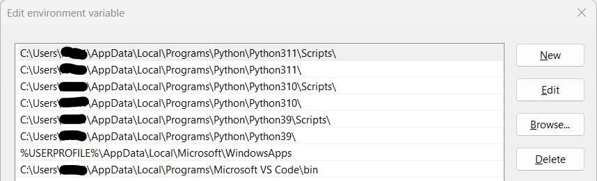
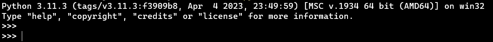

# Namestitev Python-a na sistem Windows

## Predstavitev namestitvenih opcij
- [Using Python on Windows](https://docs.python.org/3/using/windows.html)

Unlike most Unix systems and services, **Windows does not include a system supported installation of Python**.

Python 3.11 supports Windows 8.1 and newer. If you require Windows 7 support, please install Python 3.8.

There are a number of different installers available for Windows, each with certain benefits and downsides:
- The **full installer** contains all components and is the best option for developers using Python for any kind of project.
- The **Microsoft Store package** is a simple installation of Python that is suitable for running scripts and packages, and using IDLE or other development environments. It requires Windows 10 and above, but can be safely installed without corrupting other programs. It also provides many convenient commands for launching Python and its tools
- The **nuget.org packages**
- The **embeddable package**

## Namestitev najnovejše verzije Pythona

Four Python 3.11 installers are available for download - two each for the 32-bit and 64-bit versions of the interpreter.

Download the installer from the [official Python download page](https://www.python.org/downloads/).

After starting the installer, one of two options may be selected:

- If you select **Install Now**:
    - You will not need to be an administrator (unless a system update for the C Runtime Library is required or you install the Python Launcher for Windows for all users)
    - Python will be installed into your user directory
    - The Python Launcher for Windows will be installed according to the option at the bottom of the first page
    - The standard library, test suite, launcher and pip will be installed
    - If selected, the install directory will be added to your PATH
    - Shortcuts will only be visible for the current user
- Selecting **Customize installation** will allow you to select the features to install, the installation location and other options or post-install actions.

Python is installed in the directory `C:\Users\<username>\AppData\Local\Programs\Python\Python<version>`, where `<username>` is the name of the logged-in user and `<version>` is the installed version, for example `Python38`.

> **Removing the MAX_PATH Limitation**: Windows historically has limited path lengths to 260 characters. This meant that paths longer than this would not resolve and errors would result. In the latest versions of Windows, this limitation can be expanded to approximately 32,000 characters. Your administrator will need to activate the “Enable Win32 long paths” group policy, or set LongPathsEnabled to 1 in the registry key `HKEY_LOCAL_MACHINE\SYSTEM\CurrentControlSet\Control\FileSystem`.

Python has been installed. You can start Python by typing `python` in the command prompt (`cmd.exe`) or by clicking on the Python icon in the Start Menu.

> To run Python conveniently from a command prompt, you might consider changing some default environment variables in Windows. While the installer provides an option to configure the PATH and PATHEXT variables for you, this is only reliable for a single, system-wide installation.

## Uvod v terminal
- [Windows Commands](https://learn.microsoft.com/en-us/windows-server/administration/windows-commands/windows-commands)

The Windows Terminal is a modern, fast, efficient, powerful, and productive terminal application for users of command-line tools and shells like Command Prompt, PowerShell, and WSL. Its main features include multiple tabs, panes, Unicode and UTF-8 character support, a GPU accelerated text rendering engine, and custom themes, styles, and configurations.
- Download the Windows Terminal from the [Microsoft Store](https://apps.microsoft.com/store/detail/windows-terminal/9N0DX20HK701).

Windows has two command-line shells: the **Command shell** and **PowerShell**. Each shell is a software program that provides direct communication between you and the operating system or application, providing an environment to automate IT operations.
- The **Command shell** was the first shell built into Windows to automate routine tasks, like user account management or nightly backups, with batch (.bat) files. With Windows Script Host, you could run more sophisticated scripts in the Command shell.
- **PowerShell** was designed to extend the capabilities of the Command shell to run PowerShell commands called cmdlets. Cmdlets are similar to Windows Commands but provide a more extensible scripting language. You can run both Windows Commands and PowerShell cmdlets in PowerShell, but the Command shell can only run Windows Commands and not PowerShell cmdlets.

## Namestitev več hkratnih verziji Pythona
**Install another version of Python** while retaining the old version. This will allow you to switch between the versions from the command line.

To permanently modify the default environment variables: 
1. Click Start and search for *edit environment variables*, or open System properties, Advanced system settings and click the Environment Variables button. 
2. In this dialog, you can add or modify User and System variables. 
3. To change System variables, you need non-restricted access to your machine (i.e. Administrator rights).
4. Add the Python directory to the PATH variable and click OK.
    - `C:\Users\<username>\AppData\Local\Programs\Python\Python<version>`
    - `C:\Users\<username>\AppData\Local\Programs\Python\Python<version>\Scripts\`
    - Sort the entries from the newest to the oldest version.

> Windows will concatenate User variables after System variables, which may cause unexpected results when modifying PATH.

Open a new terminal and verify the installation was successful by typing `python --version` and `pip --version`. 

To access another Python version use: `python310 --version`.

## Python Launcher for Windows
- [Python Launcher for Windows](https://docs.python.org/3/using/windows.html#python-launcher-for-windows)

The Python launcher for Windows is a utility which aids in locating and executing of different Python versions. It allows scripts (or the command-line) to indicate a preference for a specific Python version, and will locate and execute that version.

Unlike the PATH variable, the launcher will correctly select the most appropriate version of Python. It will prefer per-user installations over system-wide ones, and orders by language version rather than using the most recently installed version.

The launcher is compatible with all available versions of Python, so it does not matter which version is installed. To check that the launcher is available, execute the following command in Command Prompt: 
-  `py`: You should find that the latest version of Python you have installed is started.
- The command displays the currently installed version(s) of Python: `py --list`
- If you have multiple versions of Python installed (e.g., 3.10 and 3.11) you will have noticed that Python 3.11 was started - to launch Python 3.10, try the command: `py -3.10`

## Pyenv za Windows
- [pyenv for Windows](https://github.com/pyenv-win/pyenv-win)

pyenv is a simple python version management tool. It lets you easily switch between multiple versions of Python. It's simple, unobtrusive, and follows the UNIX tradition of single-purpose tools that do one thing well.
1. Install pyenv-win in PowerShell: `Invoke-WebRequest -UseBasicParsing -Uri "https://raw.githubusercontent.com/pyenv-win/pyenv-win/master/pyenv-win/install-pyenv-win.ps1" -OutFile "./install-pyenv-win.ps1"; &"./install-pyenv-win.ps1"`
2. Reopen PowerShell
3. Run `pyenv --version` to check if the installation was successful.

Common commands:
- List all Python versions available to pyenv: `pyenv versions`
- Run `pyenv install -l` to check a list of Python versions supported by pyenv-win.
- Install a Python version: `pyenv install <version>`
> Installed versions are saved to: `C:\Users\<user>\.pyenv\pyenv-win\versions`
- Run `pyenv global <version>` to set a Python version as the global version.
- Check which Python version you are using and its path: `pyenv version`
- Test the Python version: `python --version`

Set a version for a specific project:
1. Create a new folder for your project: `mkdir <project>`
2. Navigate to the project folder: `cd <project>`
3. Set a Python version for the project: `pyenv local <version>`
    - Check the Python version: `pyenv version`
    - A `.python-version` file will be created in the project folder. This file contains the Python version that will be used when you navigate to the project folder.
4. Test the Python version: `python --version`

How to update pyenv. Run the following in a Powershell terminal: `&"${env:PYENV_HOME}\install-pyenv-win.ps1"`

## Uvod v Python shell
- [The Interpreter, an Interactive Shell](https://python-course.eu/python-tutorial/interpreter-interactive-shell.php)

To start the Python shell, open the Command Prompt and run `python` or `py`. You should see the Python shell open with the version number printed to the screen.

When commands are read from a tty, the interpreter is said to be in interactive mode. In this mode it prompts for the next command with the primary prompt, usually three greater-than signs (>>>); for continuation lines it prompts with the secondary prompt, by default three dots (...). The interpreter prints a welcome message stating its version number and a copyright notice before printing the first prompt:

Now you can type Python commands into the shell. A simple command like `print("Hello World!")` will print the text `Hello World!` to the screen.

Typing an end-of-file character (Control-D on Unix, `Control-Z` on Windows) at the primary prompt causes the interpreter to exit with a zero exit status. If that doesn’t work, you can exit the interpreter by typing the following command: `quit()`.

## Osnovni zagon Python skript

## Odstarnitev stare verzije Pythona
Once Python has been installed, you can add or remove features through the Programs and Features tool that is part of Windows. Select the Python entry and choose “Uninstall/Change” to open the installer in maintenance mode.

**Uninstall** will remove Python entirely, with the exception of the Python Launcher for Windows, which has its own entry in Programs and Features.

Remove the PATH entry for the Python version you are removing.

- development python knjižnice python-dev

 