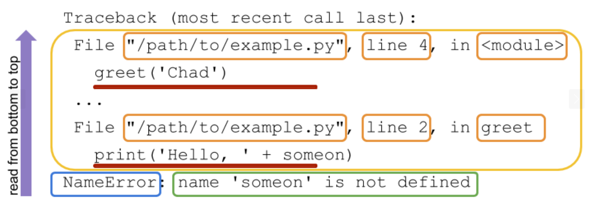

# Odpravljanje težav - debugging

- [Errors and Exceptions](https://docs.python.org/3/tutorial/errors.html)
- [Built-in Exceptions](https://docs.python.org/3/library/exceptions.html#Exception)
- [How to Understand Python Error Messages](https://vegibit.com/how-to-understand-python-error-messages/)

## Python exceptions
There are (at least) two distinguishable kinds of errors: **syntax errors** and **exceptions**.

**Syntax errors, also known as parsing errors, are perhaps the most common kind** of complaint you get while you are still learning Python:
```python
>>> while True print('Hello world')
  File "<stdin>", line 1
    while True print('Hello world')
                   ^
SyntaxError: invalid syntax
``` 
The parser repeats the offending line and displays a little ‘arrow’ pointing at the earliest point in the line where the error was detected. The error is caused by (or at least detected at) the token preceding the arrow: in the example, the error is detected at the function print(), since a colon (':') is missing before it. File name and line number are printed so you know where to look in case the input came from a script.

Even if a statement or expression is syntactically correct, it may cause an error when an attempt is made to execute it. **Errors detected during execution are called exceptions and are not unconditionally fata**l: you will soon learn how to handle them in Python programs. Most exceptions are not handled by programs, however, and result in error messages as shown here:
```python
>>> 10 * (1/0)
Traceback (most recent call last):
  File "<stdin>", line 1, in <module>
ZeroDivisionError: division by zero
>>> 4 + spam*3
Traceback (most recent call last):
  File "<stdin>", line 1, in <module>
NameError: name 'spam' is not defined
>>> '2' + 2
Traceback (most recent call last):
  File "<stdin>", line 1, in <module>
TypeError: can only concatenate str (not "int") to str
```

## Reading Python Traceback
- [Understanding the Python Traceback](https://realpython.com/python-traceback/)

Python prints a traceback when an exception is raised in your code. The traceback output can be a bit overwhelming if you’re seeing it for the first time or you don’t know what it’s telling you. But the Python traceback has a wealth of information that can help you diagnose and fix the reason for the exception being raised in your code. Understanding what information a Python traceback provides is vital to becoming a better Python programmer.

A **traceback is a report containing the function calls made in your code at a specific point**. Tracebacks are known by many names, including stack trace, stack traceback, backtrace, and maybe others. In Python, the term used is traceback.



A **Python traceback should be read from bottom to top**. This is very helpful since the traceback is printed out and your terminal (or wherever you are reading the traceback) usually ends up at the bottom of the output, giving you the perfect place to start reading the traceback.

## Kako se lotimo reševanja težav Python programov?
When we finish writing a piece of Python code, it often does not run well normally. That’s when we need to **debug the code**.

- **Google the Error Message**:
    - When an error occurs, Python will print out an error message.
    - The error message contains the type of error and the line number where the error occurred.
    - We can copy the error message and search it on Google to find out the reason for the error.
    - The error message is usually very long, so we can copy the last line of the error message and search it on Google.

- **Use [Stack Overflow](https://stackoverflow.com/)**:
    - Stack Overflow is a question and answer site for professional and enthusiast programmers.
    - It is a great place to find solutions to programming problems.
    - We can copy the error message and search it on Stack Overflow to find out the reason for the error.
    - The error message is usually very long, so we can copy the last line of the error message and search it on Stack Overflow.

- **Use ChatGPT**:
    - ChatGPT is an AI chatbot that can answer programming questions.
    - We can copy the error message and paste it into the chatbot to find out the reason for the error.
    - [How to Debug Code Using ChatGPT](https://rollbar.com/blog/how-to-debug-code-using-chatgpt/)
    - [ChatGPT: The AI Assistant That Can Run and Debug Your Code](https://medium.com/@stringmeteor/chatgpt-the-ai-assistant-that-can-run-and-debug-your-code-8bf8476496f2)
    - [phind - The AI search engine for developers.](https://www.phind.com/)
    - [ChatGPT OpenAI](https://chat.openai.com/)

- **Printing a Variable’s Value**:
    - The simplest way to debug a program is to print out the value of a variable at a certain point in the program.
    - This is a very common way to debug a program.
    - We can print out the value of a variable by using the `print()` function.
    - After the code runs, check the values of the variable printed out in the terminal to find out the reason for the error.

- **Use a Debugger**:
    - [Python Debugging With Pdb](https://realpython.com/python-debugging-pdb/)
    - [Python debugging in VS Code](https://code.visualstudio.com/docs/python/debugging)

