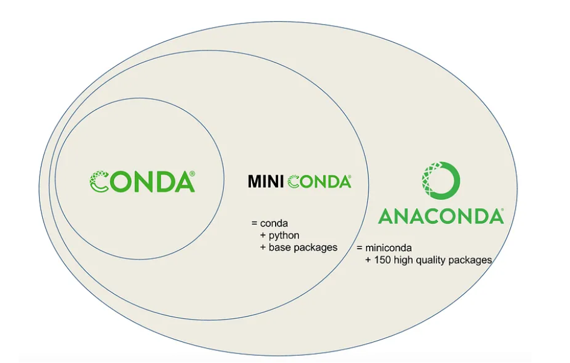

# Ekosistem Conda

## Predstavitev ekosistema Conda

### Conda
The **package and environment manager program** bundled with Anaconda that installs and updates conda packages and their dependencies. Conda also lets you easily switch between conda environments on your local computer.

### Miniconda
A free **minimal installer for conda**. Miniconda is a small, bootstrap version of Anaconda that includes only conda, Python, the packages they depend on, and a small number of other useful packages, including pip, zlib, and a few others.

### Anaconda
A downloadable, free, **open-source, high-performance, and optimized Python and R** distribution. Anaconda includes `conda`, `conda-build`, `Python`, and **250+ automatically installed, open-source scientific packages** and their dependencies that have been tested to work well together, including SciPy, NumPy, and many others. 

> Because Anaconda is a Python distribution, it can make installing Python quick and easy even for new users.

### Anaconda.org
A web-based, repository hosting service in the cloud. Packages created locally can be published to the cloud to be shared with others. `Anaconda.org` is a public version of Anaconda Repository and was formerly known as Anaconda Cloud.

## Namestitev
- https://docs.conda.io/en/latest/miniconda.html

- https://towardsdatascience.com/managing-project-specific-environments-with-conda-b8b50aa8be0e
- https://docs.conda.io/projects/conda/en/stable/glossary.html

•	DAN 6: EKOSISTEM CONDA IN PRAKTIČEN ZAGON PROGRAMOV NA SISTEMU WINDOWS
o	
o	
o	Pregled komand in načina dela
o	Namestitev zuanjih knjižnic
o	Praktični primeri postavitve programov 

Namestitev
- http://sanger-pathogens.github.io/Artemis/ACT/

## Conda
- https://docs.conda.io/projects/conda/en/stable/index.html
- https://realpython.com/python-virtual-environments-a-primer/#the-conda-package-and-environment-manager
- https://docs.conda.io/projects/conda/en/stable/user-guide/install/windows.html

## Bioconda
- https://bioconda.github.io/