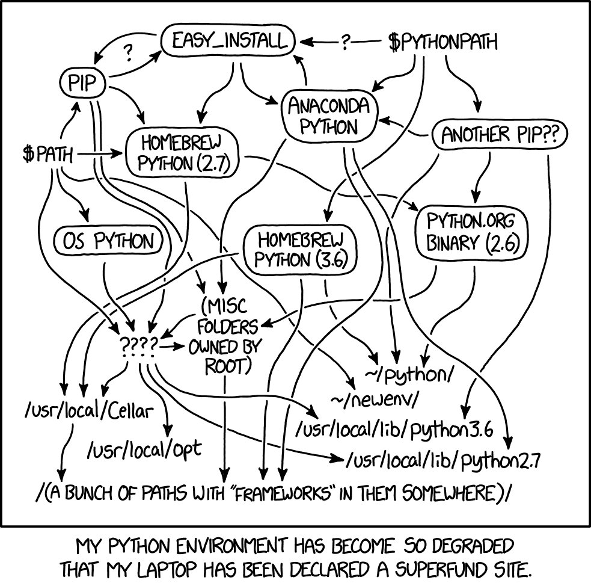
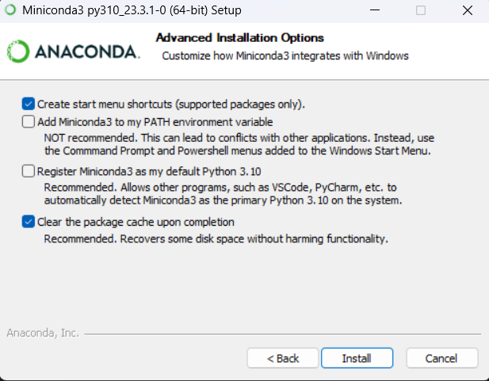

# Ekosistem Conda

- [The definitive guide to Python virtual environments with conda](https://whiteboxml.com/blog/the-definitive-guide-to-python-virtual-environments-with-conda)
- [Getting Started with Conda](https://towardsdatascience.com/managing-project-specific-environments-with-conda-b8b50aa8be0e)
- [Getting started with conda](https://conda.io/projects/conda/en/stable/user-guide/getting-started.html)
- [Glossary](https://docs.conda.io/projects/conda/en/stable/glossary.html)

## Predstavitev ekosistema Conda

### Conda
The **package and environment manager program** bundled with Anaconda that installs and updates conda packages and their dependencies. Conda also lets you easily switch between conda environments on your local computer.

### Miniconda
A free **minimal installer for conda**. Miniconda is a small, bootstrap version of Anaconda that includes only conda, Python, the packages they depend on, and a small number of other useful packages, including pip, zlib, and a few others.

> The available library catalog is the same for Anaconda and Miniconda, and there is no advantage of installing Anaconda over Miniconda (unless you want to lose 500 Mb of storage in your hard drive). Just **install Miniconda and let conda (remember, the virtual environment manager) download and install the last version of packages from the internet as needed.**

### Anaconda
A downloadable, free, **open-source, high-performance, and optimized Python and R** distribution. Anaconda includes `conda`, `conda-build`, `Python`, and **250+ automatically installed, open-source scientific packages** and their dependencies that have been tested to work well together, including SciPy, NumPy, and many others. 

> Because Anaconda is a Python distribution, it can make installing Python quick and easy even for new users.

### Anaconda.org
A web-based, repository hosting service in the cloud. Packages created locally can be published to the cloud to be shared with others. `Anaconda.org` is a public version of Anaconda Repository and was formerly known as Anaconda Cloud.

### Anaconda Navigator
[Anaconda Navigator](https://docs.anaconda.com/free/navigator/) is a desktop graphical user interface (GUI) included in Anaconda® Distribution that allows you to launch applications and manage conda packages, environments, and channels without using command line interface (CLI) commands. Navigator can search for packages on Anaconda.org or in a local Anaconda Repository. It is available for Windows, macOS, and Linux.

## Namestitev ekosistema Conda
- [Installation](https://conda.io/projects/conda/en/stable/user-guide/install/index.html#)

The fastest way to obtain conda is to install Miniconda, a mini version of Anaconda that includes only conda and its dependencies.

**You do not need to uninstall other Python installations or packages in order to use conda.**

[Miniconda](https://docs.conda.io/en/latest/miniconda.html#) is a free minimal installer for conda. It is a small, bootstrap version of Anaconda that includes only conda, Python, the packages they depend on, and a small number of other useful packages, including pip, zlib and a few others. 

> [Anaconda or Miniconda?](https://docs.conda.io/projects/conda/en/stable/user-guide/install/download.html#anaconda-or-miniconda)

On Windows, macOS, and Linux, it is best to install Miniconda **for the local user, which does not require administrator permissions** and is the most robust type of installation.

- [Installing on Windows](https://docs.conda.io/projects/conda/en/stable/user-guide/install/windows.html)
- [Windows installers](https://docs.conda.io/en/latest/miniconda.html#windows-installers) -> Choose the Python 3.10 Miniconda3 Windows 64-bit installer. Download it.

[Verify your installer hashes.](https://conda.io/projects/conda/en/stable/user-guide/install/download.html#cryptographic-hash-verification)
- `Get-FileHash .\Miniconda3-py310_23.3.1-0-Windows-x86_64.exe -Algorithm SHA256`

**Install Miniconda on Windows:**
1. Click `Next`.
2. Read the licensing terms and click `I Agree`.
3. Select an install for “Just Me” and click `Next`.
4. Select a destination folder to install Miniconda (default is ok) and click `Next`.
5. Select the following and click `Install`:

6. Click `Next`.
7. Uncheck the boxes and click `Finish`.

When installation is finished, from the `Start menu`, open the `Anaconda PowerShell Prompt`.

Test your installation. Run the command `conda list`. A list of installed packages appears if it has been installed correctly.

> Is recommend that you always keep conda updated to the latest version.

- [Updating conda](https://docs.conda.io/projects/conda/en/stable/user-guide/install/windows.html#updating-conda)
- [Uninstalling conda](https://docs.conda.io/projects/conda/en/stable/user-guide/install/windows.html#uninstalling-conda)
    - `conda update conda`

## Uporaba ekosistema Conda
- [Command reference](https://docs.conda.io/projects/conda/en/stable/commands.html)

Verify that conda is installed and running on your system by typing: `conda --version`

The `conda` command is the **primary interface for managing installations of various packages**. It can:
- Query and search the Anaconda package index and current Anaconda installation.
- Create new conda environments.
- Install and update packages into existing conda environments.

### Managing environments
- [Conda environments](https://docs.conda.io/projects/conda/en/stable/user-guide/concepts/environments.html)
- [Managing environments](https://docs.conda.io/projects/conda/en/stable/user-guide/tasks/manage-environments.html)

Conda allows you to create separate environments containing files, packages, and their dependencies that will not interact with other environments.

When you begin using conda, you already have a default environment named `base`. **You don't want to put programs into your `base` environment**, though. Create separate environments to keep your programs isolated from each other.

A conda environment is **a directory that contains a specific collection of conda packages that you have installed.** For example, you may have one environment with NumPy 1.7 and its dependencies, and another environment with NumPy 1.6 for legacy testing. If you change one environment, your other environments are not affected. You can easily activate or deactivate environments, which is how you switch between them. You can also share your environment with someone by giving them a copy of your `environment.yaml` file.

1. Move to the directory where you want to create the environment: `cd <path to directory>`
2. Create a new environment:
    - `conda create --name test`
    - Type `y` and press Enter to proceed.
    - No packages will be installed in this environment.
        - `conda list`

> By default, environments are installed into the envs directory in your conda directory. [Specifying a location for an environment](https://docs.conda.io/projects/conda/en/stable/user-guide/tasks/manage-environments.html#specifying-a-location-for-an-environment)

3. To use, or "activate" the new environment, type the following: `conda activate test`
4. Now that you are in your test environment, any conda commands you type will go to that environment until you deactivate it.
5. To see a list of all your environments, type: 
    - `conda info --envs`
6. To deactivate your environment, type: `conda deactivate`
    - When the environment is deactivated, its name is no longer shown in your prompt, and the asterisk (*) returns to base.
    - `conda info --envs`

> The active environment is the one with an asterisk (*).

#### Python virtual environment vs Conda environment

Most people think that conda is for Python, but the reality is that a conda virtual environment is a generic environment where you can install almost anything.

|                         | Python virtual environment                                            | Conda virtual environment                                         |
|-------------------------|-----------------------------------------------------------------------|-------------------------------------------------------------------|
| Libraries               | Statically link, vendor libraries in wheels, or use apt/yum/brew/etc. | Install system-level libraries as conda dependencies.             |
| System                  | Depend on base system install of Python.                              | Python is independent from system.                                |
| Extending environment   | Extend environment with pip.                                          | Extended environment with conda or pip.                           |
| Non-Python dependencies |                                                                       | Manages non-Python dependencies (R, Perl, arbitrary executables). |
| Tracking dependencies   |                                                                       | Tracks binary dependencies explicitly.                            |

Some questions to consider as you determine your preferred workflow and virtual environment:
- Is your environment shared across multiple code projects?
- Does your environment live alongside your code or in a separate place?
- Do your install steps involve installing any external libraries?
- Do you want to ship your environment as an archive of some sort containing the actual files of the environment?

### Managing Python
- [Managing Python](https://docs.conda.io/projects/conda/en/stable/user-guide/tasks/manage-python.html)

Conda treats Python the same as any other package, so it is easy to manage and update multiple installations.

To list the versions of Python that are available to install, in your terminal window or an Anaconda Prompt, run:
- `conda search python`

When you create a new environment, conda installs the same Python version you used when you downloaded and installed Anaconda. If you want to **use a different version of Python**, for example Python 3.5, simply create a new environment and specify the version of Python that you want.
1. Create a new environment named `projekt-stari` that contains Python 3.9:
    - `conda create --name projekt-stari python=3.9`
2. Activate the new environment: `conda activate projekt-stari`
3. Verify that the environment has been added and is active: `conda info --envs`
4. Verify which version of Python is in your current environment: `python --version`
5. Deactivate the snakes environment and return to base environment: `conda deactivate`

### Managing packages
- [Conda packages](https://docs.conda.io/projects/conda/en/stable/user-guide/concepts/packages.html)
- [Managing packages](https://docs.conda.io/projects/conda/en/stable/user-guide/tasks/manage-pkgs.html)

A **conda package is a compressed tarball file (.tar.bz2) or [.conda](https://docs.conda.io/projects/conda/en/stable/user-guide/concepts/packages.html#conda-file-format) file** that contains:
- system-level libraries.
- Python or other modules.
- executable programs and other components.
- metadata under the info/ directory.
- a collection of files that are installed directly into an install prefix.

> .conda is the preferred file format to use where available, although we continue to provide .tar.bz2 files in tandem.

Conda keeps **track of the dependencies** between packages and platforms. The conda package format is **identical across platforms** and operating systems.

1. Activate the environment where you want to install the package: `conda activate test`
2. Check if a package is installed: `conda list`
3. Check to see if a package is available from the Anaconda repository: `conda search beautifulsoup4`
4. Install a package: `conda install beautifulsoup4`
5. Check to see if the newly installed program is in this environment: `conda list`

> It is best to install all packages at once, so that all of the dependencies are installed at the same time. Installing 1 program at a time can lead to dependency conflicts.

To install multiple packages at once and specify the version of the package:
- `conda install pandas=1.5.3 numpy=1.25.0`

#### Using pip in an environment

**Issues may arise when using pip and conda together**. When combining conda and pip, it is best to use an isolated conda environment. **Only after conda has been used to install as many packages as possible should pip be used to install any remaining software**. If modifications are needed to the environment, it is best to create a new environment rather than running conda after pip. When appropriate, conda and pip requirements should be **stored in text files.**

Recommendations:
- Install as many requirements as possible with conda then use pip.
- Create a conda environment to isolate any changes pip makes. (Care should be taken to avoid running pip in the root environment.)
- Once pip has been used, conda will be unaware of the changes.
- To install additional conda packages, it is best to recreate the environment.
- Store conda and pip requirements in text files

### Managing channels
- [Managing channels](https://docs.conda.io/projects/conda/en/stable/user-guide/tasks/manage-channels.html)
- [Conda channels](https://docs.conda.io/projects/conda/en/stable/user-guide/concepts/channels.html)

**Conda channels are the locations where packages are stored.** They serve as the base for hosting and managing packages. Conda packages are downloaded from remote channels, which are URLs to directories containing conda packages. 
 

<!-- - TODO----------------------------------------- -->

<!-- - kako izvozimo okolje v environment.yml
- Namestitev zuanjih knjižnic
- Praktični primeri postavitve programov 

Namestitev
- http://sanger-pathogens.github.io/Artemis/ACT/
- https://docs.conda.io/projects/conda/en/stable/index.html
- https://realpython.com/python-virtual-environments-a-primer/#the-conda-package-and-environment-manager
- https://docs.conda.io/projects/conda/en/stable/user-guide/install/windows.html

## Bioconda
- https://bioconda.github.io/ -->